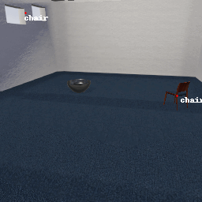
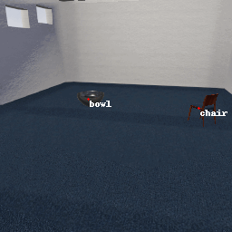

# MetaCOG

This is the repo containing the data and code to accompany the 2024 UAI paper "MetaCOG: A Hierarchical Probabilistic Model for Learning Meta-Cognitive Visual Representations" by [Marlene Berke](https://marleneberke.github.io/), Zhangir Azerbayev, Mario Belledonne, Zenna Tavares, and [Julian Jara-Ettinger](https://compdevlab.yale.edu/).

## Demos
The gif below shows the output of the neural object detector Faster R-CNN on a scene from our dataset: 

Note how the TV is rarely detected, and it is once mistaken for a chair. Faster R-CNN also "hallucinates" TVs in the background of the scene.

Using only these detections output by Faster R-CNN plus the camera trajectory, MetaCOG is able to successfully infer what objects are where in the scene:

By assuming that objects are stable entities that do not pop in and out of existence (i.e., object permanence), MetaCOG recovers the world state from these noisy detections.

MetaCOG's success is not limited to Faster R-CNN. Below are the outputs of RetinaNet on another scene from our dataset:

And here are MetaCOG's inferences about the objects in the scene:

MetaCOG has successfully corrected RetinaNet's mistakes by filtering out the erroneous TV halluncinations, filling in missed detections of the chair and the bowl, and correcting misdetections (like mistaking the chair for a potted plant).

## Code
This repository is organized as follows.

The "Exp 1" folder contains the code and data for the main results of Experiment 1. The code for MetaCOG is located in the "Model code" folder and is provided as a [julia package](https://julialang.org/packages/). Data (the images rendered in TDW along with the code for rendering them, and the results from RetinaNet, Faster_Rcnn, and DETR) are located in the "Code for rendering the dataset, and all results" folder. The outputs of the NNs can be found in the .json files. Under the subfolder, there are .csv files. Some of these csv files contain the raw data output by the MetaCOG model (for example, the online_ws.csv, online_V.csv files, etc). Other csv files contain the data in a more processed form, applying our metrics (for example, similarity2D.csv, and online_V_processed.csv). The code for processing the raw data output by MetaCOG is located in the "Analysis code" folder, under "Processing data from MetaCOG." The code for creating the figures and tables shown in the paper is located under "Final analyses and figures with processed data" folder.

The "Exp 2" folder contains the code and data for the main results of Experiment 2. The code for the Lightweight MetaCOG model is located under the "Lightweight MetaCOG model code" folder. The data produced by running the model 40000 is much to large to provide. Instead, we provide the data in a pre-processed format. Because of file size limitations, the data is split up into multiple chunks, each as a csv file, located in the csv_files folder. Last the analysis_of_processed_data.R contains the code used to generate the plots shown for Exp 2.
